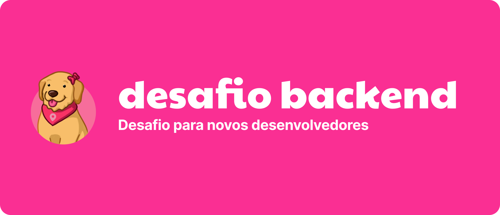

<div align="center">
  
  <p> Desafio Back-end - Housi</p>
</div>

**Objetivo:** Desenvolver uma API backend para gerenciar reservas, utilizando MongoDB. A API deve ser capaz de retornar um conjunto de datas bloqueadas baseadas em um intervalo de tempo definido.

## Tarefa Principal:

- Implementar uma rota que interaja com um banco de dados MongoDB contendo informações de reservas.
- Esta rota deve aceitar dois parâmetros, `start` e `end`, que definem o início e o fim de um período.
- A API deve processar esses parâmetros e retornar um array de datas que representem todas as datas bloqueadas dentro do intervalo especificado. Caso não seja informado, deve retornar todos os bloqueios de hoje em diante.
- A solução deve ser replicável utilizando Docker, garantindo facilidade de configuração e execução.
- Providenciar documentação clara para a instalação e execução do projeto.

**Exemplo de Uso:**

```json
{
  "host": "localhost:3000",
  "endpoint": "/properties/:id/busy-dates",
  "method": "GET",
  "queryParams": {
    "start": "2024-01-01", // opcional
    "end": "2024-01-30" // opcional
  },
  "response": [
    "2024-01-03",
    "2024-01-05",
    "2024-01-08",
    "2024-01-09",
    "2024-01-10",
    ...
  ]
}
```

## Bônus (Opcional)

- Criação de uma documentação detalhada para a API (utilizando ferramentas como Swagger).
- Implementação de índices apropriados no MongoDB para otimizar a consulta das datas bloqueadas.
- Desenvolvimento de testes unitários para garantir a funcionalidade e a qualidade do código.

## OBS

> Utilize o arquivo `seed.json` para popular seu banco de dados no MongoDB.

> A escolha de linguagem de programação e framework é livre. Se optar por utilizar Node.js, o uso de TypeScript é obrigatório.
